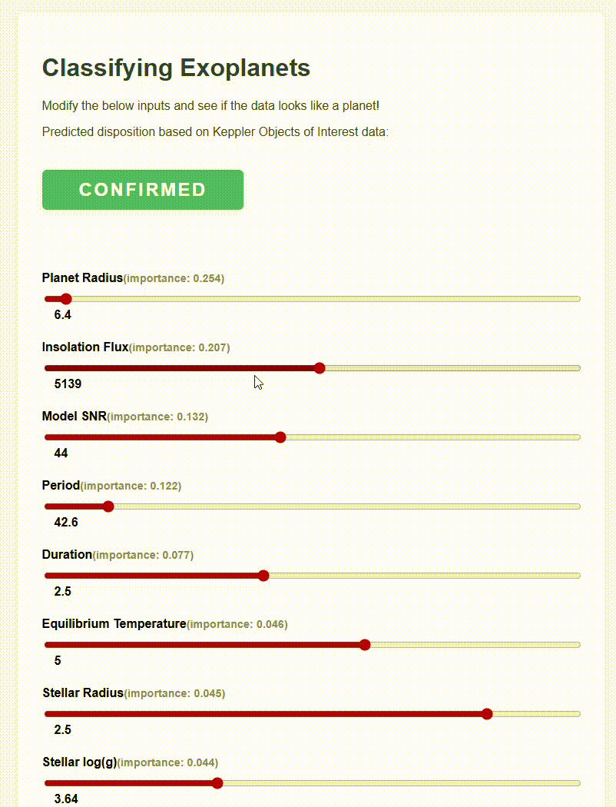

NASA Space Apps Challenge: A World Away: Hunting for Exoplanets with AI

A tool to help build insight and intuition around exoplanet classification.



To run the project:

```
python src/server.py
```

See the data analysis and model trainig in the [Exploring KOI Notebook](/src/exploring_koi.ipynb).

This project is based on the (Keppler Objects of Interest dataset)[https://exoplanetarchive.ipac.caltech.edu/cgi-bin/TblView/nph-tblView?app=ExoTbls&config=cumulative]